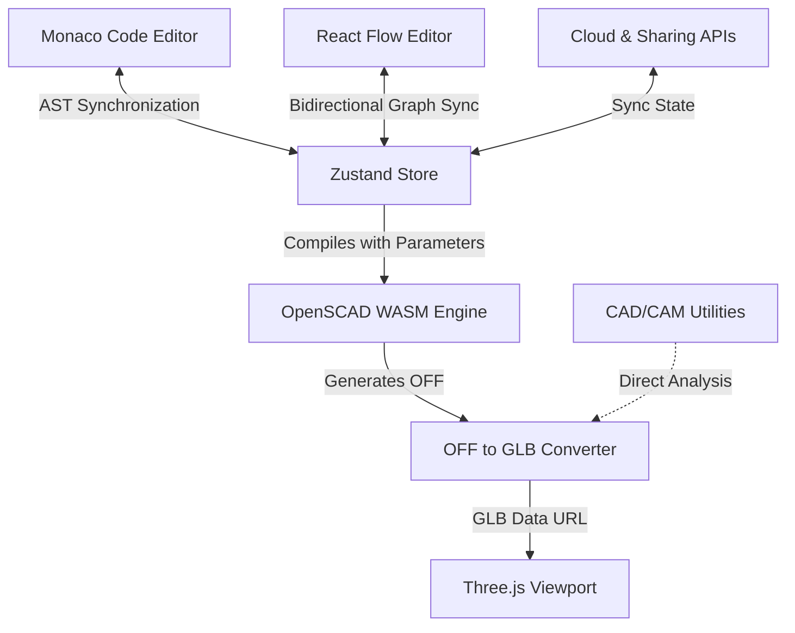
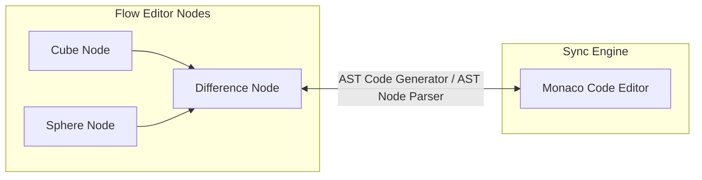

# ScadFlow Extended Roadmap

This document outlines the strategic roadmap for ScadFlow, evolving it from a web-based OpenSCAD editor into a comprehensive visual CAD environment. The milestones below reflect the decisions made during the design interview.

---

## 📅 Milestone 1: Sharing & Viewport Tools
*Evolving user engagement, rendering quality, and ease of sharing.*

### 1. Viewport Enhancements
* **Camera Toggle**: Support switching between standard perspective rendering (ideal for presentation) and orthographic projection (ideal for alignment and structural planning).
* **Section Slicing (Clipping Planes)**: An interactive tool allowing users to cut through the 3D model with virtual coordinate planes (X, Y, Z) to inspect internal structure and nesting.
* **Measurement Tools**: Tap two points in the 3D view to display real-time physical dimensions and distances.
* **Basic Animator**: Support standard OpenSCAD `$t` animations with play/pause controls, frame step buttons, and speed controls in the UI.

### 2. Sharing & Examples
* **URL State Encoding**: Compression of current SCAD code and active parameters into base64/gzip URI query params, allowing instant sharing via copy-paste.
* **Preset Gallery**: A responsive drawer pre-populated with common design templates (gears, boxes, customizable brackets) to showcase the power of parameter adjustments.

---

## 📅 Milestone 2: CAD/CAM Manufacturing Integrations
*Connecting digital designs directly to physical 3D printers and manufacturing workflows.*

### 1. Mesh Calculations
* **Physical Properties**: Direct parsing of the generated mesh to compute total Volume ($mm^3$), Surface Area ($mm^2$), Bounding Box dimensions, and Center of Mass.
* **Print Time / Filament Estimation**: Simple heuristic analysis to estimate weight and filament consumption based on materials like PLA or PETG.

### 2. Print & Repair Pipelines
* **Mesh Repair**: Simple heuristics to detect and report non-manifold edges, self-intersections, and open holes before printing.
* **OctoPrint & Klipper Integration**: Configure API credentials in ScadFlow settings to upload exported STL/GLB files directly to local 3D print servers with a single click.

---

## 📅 Milestone 3: Bidirectional Visual Flow Editor
*A visual programming layer utilizing React Flow, bidirectionally synchronized with the Monaco Editor.*

### 1. The Sync Engine (AST-Driven)
* **OpenSCAD to AST Parser**: Parse OpenSCAD code into a visual node tree. The parser reads shapes, modules, and operators, generating coordinate nodes on a React Flow canvas.
* **Nodes to OpenSCAD Generator**: A compiler converting the visual graph back to structured OpenSCAD.
* **Raw Code Nodes**: When the AST parser encounters a block of code it cannot cleanly represent visually (e.g., highly complex modules or custom recursion), it wraps that portion inside a specialized **"Raw Code Node"** container to prevent code loss.
* **Throttled Bidirectional Sync**: To avoid editor stuttering, AST compilation and node layout updates will run on a throttled loop (e.g., 500ms debounce during editing).

### 2. React Flow UI implementation
* **Workspace Split Layout**: A dual-panel system where users can toggle between Editor-only, Node-only, or Split view modes.
* **Node Types**:
  * **Primitives**: `cube`, `sphere`, `cylinder`, `polyhedron`.
  * **Transforms**: `translate`, `rotate`, `scale`, `mirror`.
  * **Booleans**: `union`, `difference`, `intersection`.
  * **Controls**: `for` loops, `if/else` conditionals, variable declarations, module definitions.
  * **Parameters**: Node controls that map properties straight to the customizer variables.
